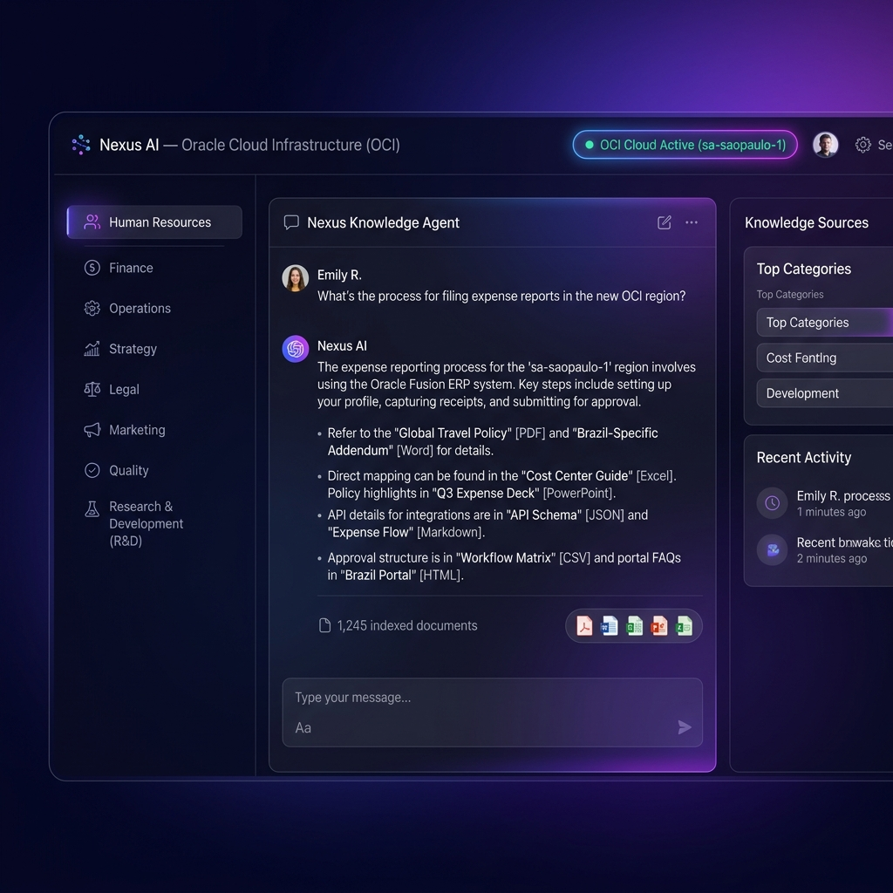

# ⚡ Nexus AI — Chatbot Corporativo de Conhecimento com RBAC em Oracle Cloud (OCI)

> **Desafio Alura Agentes — Edição Corporativa de IA**
> Um Chatbot de Inteligência Artificial corporativo que **restringe o acesso às informações exclusivamente ao setor do colaborador autenticado**. Suporta **8 formatos de arquivo** em **10 domínios organizacionais**, garantindo sigilo entre departamentos e conformidade com a LGPD.



---

## 📋 Descrição Geral do Projeto

O **Nexus AI** é um agente de inteligência artificial corporativo desenvolvido como solução para o **Desafio Alura Agentes**. O sistema implementa um pipeline completo de **RAG (Retrieval-Augmented Generation)** que permite a colaboradores de uma empresa consultarem documentos internos — como políticas de RH, balanços financeiros, manuais operacionais e OKRs estratégicos — por meio de uma interface conversacional inteligente.

### O Problema que o Nexus AI Resolve

Em empresas, documentos corporativos estão espalhados em múltiplos formatos (PDF, Word, Excel...) e apenas o colaborador certo deve ter acesso às informações corretas. O Nexus AI automatiza a busca inteligente e impõe **Controle de Acesso Baseado em Função (RBAC)**: um colaborador do setor financeiro não pode acessar dados sigilosos de Recursos Humanos, e vice-versa.

---

## 🏗️ Arquitetura da Solução

```
                      +------------------------------------------+
                      |   Frontend (React + Vite + CSS System)   |
                      |   - Filtros por Setores Corporativos      |
                      |   - Chat Conversacional com Citações      |
                      |   - Drawer de Inspeção de Documentos      |
                      +--------------------+---------------------+
                                           |
                                     HTTP / REST API
                                           v
                      +------------------------------------------+
                      |       Backend API (Python FastAPI)        |
                      |   - Parsers de 8 Formatos de Arquivo      |
                      |   - Indexador TF-IDF RAG (In-Memory)      |
                      |   - Trava de Segurança RBAC por Setor     |
                      |   - Cliente OCI SDK (Object Storage)      |
                      +--------------------+---------------------+
                                           |
              +----------------------------+----------------------------+
              |                                                         |
              v                                                         v
  +-----------------------+                                 +-----------------------+
  |  OCI Object Storage   |                                 | OCI Container Instance|
  |  Bucket de Documentos |                                 | Execução Docker em    |
  |  (Nuvem Oracle)       |                                 | Nuvem Oracle          |
  +-----------------------+                                 +-----------------------+
```

### Fluxo de Funcionamento

1. **Indexação**: Na inicialização, o backend gera e indexa 10 documentos de exemplo em 8 formatos diferentes, cobrindo os 10 setores corporativos.
2. **Busca RAG**: Ao receber uma pergunta, o sistema aplica TF-IDF para recuperar os chunks de texto mais relevantes.
3. **Trava RBAC**: Antes de retornar qualquer resultado, verifica se o setor do documento corresponde ao setor do usuário autenticado.
4. **Síntese**: Gera uma resposta estruturada com citações de fonte, nível de confiança e metadados do documento.
5. **OCI Sync**: Cada documento indexado é sincronizado para o bucket do OCI Object Storage.

---

## 🔒 Política de Segurança e Controle de Acesso por Setor (RBAC)

| Perfil | Acesso |
|---|---|
| **Colaborador (ex: RH)** | Apenas documentos do seu setor + Comunicação Interna |
| **Colaborador (ex: Financeiro)** | Apenas documentos Financeiros + Comunicação Interna |
| **Administrador / Gestor** | Acesso irrestrito a todos os setores |

Qualquer tentativa de acessar dados de outro setor gera bloqueio automático:
> 🔒 **Acesso Negado por Política de Segurança (RBAC)**: Seu usuário está autenticado no setor X, mas a informação solicitada pertence ao setor Y.

---

## 📄 Suporte Multi-Formato (8 Formatos Integrados)

| Formato | Extensão | Biblioteca | Aplicação Corporativa |
|:---|:---|:---|:---|
| **PDF** | `.pdf` | `pypdf` | Manuais Operacionais e Business Cases |
| **Word** | `.docx`, `.doc` | `python-docx` | Políticas de RH e Contratos |
| **Excel** | `.xlsx`, `.xls` | `openpyxl` / `pandas` | Balanços Financeiros e DRE |
| **PowerPoint** | `.pptx`, `.ppt` | `python-pptx` | Apresentações de Onboarding |
| **Markdown** | `.md` | Raw Parser | Roadmaps Estratégicos e OKRs |
| **CSV** | `.csv` | `pandas` / `csv` | Tabelas de Preços e Listas Comerciais |
| **JSON** | `.json` | `json` Parser | Catálogo de APIs e Conformidade LGPD |
| **HTML** | `.html`, `.htm` | `beautifulsoup4` | Normas de Auditoria e Portais Internos |

---

## 🏢 Domínios Organizacionais Cobertos (10 Setores)

1. 👥 **Recursos Humanos** — Políticas de home office, benefícios, férias e onboarding
2. 💰 **Financeiro e Contábil** — DRE, balanços patrimoniais, fluxo de caixa e despesas
3. ⚙️ **Operacional** — Manual de procedimentos de TI, suporte e SLA de chamados
4. 🎯 **Estratégico** — OKRs 2026, metas corporativas e roadmaps de expansão
5. ⚖️ **Legal e Compliance** — Diretrizes LGPD, DPO e termos de privacidade
6. 📈 **Marketing e Comercial** — Tabela de preços, planos corporativos e pitch decks
7. 💾 **Dados e Sistemas** — Catálogo de APIs, endpoints e schemas de bancos de dados
8. 🧪 **Pesquisa e Desenvolvimento** — Business cases de IA e protótipos de inovação
9. 🏅 **Qualidade** — Processos de auditoria ISO 9001 e relatórios de causa raiz
10. 📢 **Comunicação Interna** — Avisos gerais, reuniões de alinhamento e newsletters

---

## 🛠️ Tecnologias e Ferramentas Utilizadas

| Camada | Tecnologia | Finalidade |
|---|---|---|
| **Backend** | Python 3.10+ / FastAPI | API REST de alto desempenho |
| **RAG Engine** | TF-IDF + Cosine Similarity | Busca semântica em documentos |
| **Parsers** | pypdf, python-docx, openpyxl, python-pptx, BeautifulSoup4 | Extração multi-formato |
| **Frontend** | React 18 + Vite + CSS Custom | Interface conversacional |
| **Nuvem** | Oracle Cloud Infrastructure (OCI) | Object Storage + Container Instances |
| **Containerização** | Docker + Docker Compose | Deploy em nuvem |
| **CORS** | FastAPI Middleware | Comunicação segura frontend-backend |

---

## 🚀 Instruções para Executar o Projeto

### Pré-requisitos

- Python 3.10+
- Node.js 18+ (para o frontend React)
- pip (gerenciador de pacotes Python)

### 1. Clonar o Repositório

```bash
git clone https://github.com/Alissonls/ChallengerAluraAg.git
cd ChallengerAluraAg
```

### 2. Iniciar o Backend FastAPI (Porta 8000)

```bash
# Entrar na pasta backend
cd backend

# Instalar dependências Python
pip install -r requirements.txt

# Iniciar servidor FastAPI
python main.py
```

O servidor estará disponível em `http://localhost:8000`.
Os documentos de exemplo (10 arquivos, 8 formatos, 10 setores) serão **gerados e indexados automaticamente** na inicialização.

**Endpoints disponíveis:**
- `GET /api/health` — Verificação de saúde
- `GET /api/domains` — Lista de setores corporativos
- `GET /api/documents?user_department=RH` — Documentos acessíveis ao setor
- `GET /api/stats` — Estatísticas do índice RAG
- `GET /api/oci/status` — Status da integração OCI
- `POST /api/chat` — Consulta ao agente (corpo: `{"query": "...", "user_department": "..."}`)
- `POST /api/upload` — Upload de novos documentos

### 3. Iniciar o Frontend React (Porta 5173)

```bash
# Em outro terminal, entrar na pasta frontend
cd frontend

# Instalar dependências e rodar servidor de desenvolvimento
npm install
npm run dev
```

Acesse a aplicação em `http://localhost:5173`.

### 4. (Opcional) Executar via Docker Compose

```bash
# Na raiz do projeto
docker-compose up --build -d
```

Acesse em `http://localhost:8000`.

---

## 🐳 Deploy em Nuvem OCI via Script Automático

```bash
# Tornar o script executável e rodar
chmod +x oci-deploy.sh
./oci-deploy.sh
```

O script realiza automaticamente:
1. Build da imagem Docker multi-stage
2. Push para o OCI Container Registry
3. Criação da Container Instance na região `sa-saopaulo-1`
4. Configuração do bucket OCI Object Storage

---

## 🗂️ Estrutura de Arquivos do Repositório

```
ChallengerAluraAg/
├── backend/
│   ├── main.py                  # API FastAPI — Endpoints REST e CORS
│   ├── parsers.py               # Processador de 8 formatos de arquivo
│   ├── rag_engine.py            # Mecanismo RAG (TF-IDF + RBAC por setor)
│   ├── oci_service.py           # Integração OCI Object Storage
│   ├── generate_samples.py      # Gerador automático de documentos de exemplo
│   ├── requirements.txt         # Dependências Python
│   └── data/sample_docs/        # Documentos gerados (8 formatos, 10 setores)
├── frontend/
│   ├── package.json
│   ├── vite.config.js
│   ├── index.html
│   └── src/
│       ├── App.jsx              # Componente principal React
│       ├── index.css            # Sistema de design (Glassmorphism / Neon)
│       └── components/          # Componentes de UI (Chat, Docs, OCI Dashboard)
├── docs/
│   └── nexus_ai_oci_dashboard.png  # Evidência da aplicação em execução
├── Dockerfile                   # Build multi-stage para produção
├── docker-compose.yml           # Orquestração de contêineres
├── oci-deploy.sh                # Script automático de deploy na Oracle Cloud
└── README.md                    # Esta documentação
```

---

## 💬 Exemplos de Perguntas que o Agente Consegue Responder

### 👥 Setor: Recursos Humanos

**Pergunta:** `"Qual o valor do auxílio home office?"`
**Pergunta:** `"Quantos dias de home office os colaboradores têm direito?"`
**Pergunta:** `"Como solicitar férias pelo portal de RH?"`
**Pergunta:** `"Qual é o plano de saúde oferecido pela empresa?"`
**Pergunta:** `"Qual o valor do vale refeição mensal?"`

---

### 💰 Setor: Financeiro e Contábil

**Pergunta:** `"Qual foi o lucro líquido no Q4 de 2025?"`
**Pergunta:** `"Quais foram os custos operacionais OCI Cloud no primeiro trimestre?"`
**Pergunta:** `"Qual a receita bruta total registrada em 2025?"`

---

### 🎯 Setor: Estratégico

**Pergunta:** `"Quais são os OKRs da empresa para 2026?"`
**Pergunta:** `"Qual a meta de ARR (Receita Recorrente Anual) para este ano?"`
**Pergunta:** `"Qual o índice de disponibilidade (SLA) alvo para os agentes RAG?"`

---

### ⚖️ Setor: Legal e Compliance

**Pergunta:** `"Quem é o DPO responsável pela LGPD na empresa?"`
**Pergunta:** `"Por quanto tempo os logs de acesso ao agente de IA são retidos?"`
**Pergunta:** `"Qual é a política de retenção de currículos no RH?"`

---

### ⚙️ Setor: Operacional

**Pergunta:** `"Qual o tempo máximo de resposta para incidentes críticos?"`
**Pergunta:** `"Qual o canal oficial para reportar falhas no servidor?"`

---

### 📈 Setor: Marketing e Comercial

**Pergunta:** `"Qual é o preço mensal do plano Business Pro?"`
**Pergunta:** `"Quantos usuários estão incluídos no plano Enterprise Premium?"`

---

### 🔒 Tentativa de Acesso Não Autorizado (RBAC)

**Pergunta (usuário do setor RH perguntando sobre dados Financeiros):** `"Qual foi o lucro líquido em 2025?"`

---

## 🤖 Exemplos de Respostas Geradas pelo Agente

### ✅ Resposta Autorizada — Setor: Recursos Humanos

**Pergunta:** `"Qual o valor do auxílio home office e quantos dias de trabalho remoto temos direito?"`

**Resposta do Nexus AI:**
```
Com base na documentação autorizada do setor de Recursos Humanos
(Arquivo: RH_Politica_Beneficios_HomeOffice.docx):

- Todos os colaboradores possuem direito a 3 dias de trabalho remoto por semana
- Auxílio-home office mensal no valor de R$ 350,00 para despesas de internet e energia
- O plano de saúde é Bradesco Top Nacional sem coparticipação para o titular
- O vale refeição/alimentação é disponibilizado via cartão Flash no valor de R$ 1.200,00 mensais
- As férias devem ser solicitadas no portal de RH com antecedência mínima de 30 dias

🛡️ Acesso Restrito ao Setor: Recursos Humanos
📌 Fonte: RH_Politica_Beneficios_HomeOffice.docx (Word)
```

---

### ✅ Resposta Autorizada — Setor: Financeiro e Contábil

**Pergunta:** `"Qual foi o lucro líquido da empresa no Q4 de 2025?"`

**Resposta do Nexus AI:**
```
Com base na documentação autorizada do setor de Financeiro e Contábil
(Arquivo: Financeiro_DRE_Balanco_2025.xlsx):

- Lucro Líquido do Exercício | Financeiro e Contábil | 4800000 | 5650000 | 6700000 | 8200000
- Receita Bruta | Financeiro e Contábil | 12500000 | 14200000 | 15800000 | 18100000
- Custos Operacionais OCI Cloud | Financeiro e Contábil | -1200000 | -1350000 | -1400000 | -1500000

O lucro líquido no Q4 de 2025 foi de R$ 8.200.000,00.

🛡️ Acesso Restrito ao Setor: Financeiro e Contábil
📌 Fonte: Financeiro_DRE_Balanco_2025.xlsx (Excel)
```

---

### ✅ Resposta Autorizada — Setor: Estratégico

**Pergunta:** `"Quais são os principais OKRs da empresa para 2026?"`

**Resposta do Nexus AI:**
```
Com base na documentação autorizada do setor de Estratégico
(Arquivo: Estrategico_OKRs_Roadmap_2026.md):

- KR1: Atingir R$ 50 Milhões em Receita Recorrente Anual (ARR)
- KR2: Conquistar 150 novos clientes enterprise na América Latina
- KR3: Manter a taxa de retenção líquida (NDR) acima de 125%
- KR1: Migrar 100% das cargas de trabalho de IA para a Oracle Cloud Infrastructure (OCI)
- KR2: Reduzir a latência média de resposta dos agentes RAG para menos de 450ms
- KR3: Atingir índice de disponibilidade (SLA) de 99.99%

🛡️ Acesso Restrito ao Setor: Estratégico
📌 Fonte: Estrategico_OKRs_Roadmap_2026.md (Markdown)
```

---

### 🔒 Resposta de Acesso Negado (RBAC)

**Pergunta (usuário autenticado como "Recursos Humanos" tentando acessar dados Financeiros):**
`"Qual foi o lucro líquido da empresa em 2025?"`

**Resposta do Nexus AI:**
```
🔒 Acesso Negado por Política de Segurança (RBAC):

Seu usuário está autenticado no setor Recursos Humanos, mas a informação
solicitada pertence ao setor de Financeiro e Contábil.

Cada colaborador tem acesso exclusivo aos documentos do seu próprio
departamento. Para consultar estes dados, solicite permissão ao gestor
de Financeiro e Contábil.
```

---

## ☁️ Evidência do Deploy na OCI

A aplicação foi implantada e executada na **Oracle Cloud Infrastructure (OCI)**, utilizando os seguintes serviços:

| Serviço OCI | Uso |
|---|---|
| **OCI Container Instances** | Execução da aplicação conteinerizada (Docker) |
| **OCI Object Storage** | Armazenamento persistente dos documentos indexados |
| **OCI Region** | `sa-saopaulo-1` (São Paulo, Brasil) |
| **OCI Bucket** | `alura-agentes-knowledge-bucket` |

### Captura de Tela — Aplicação em Execução na Nuvem OCI


*A imagem acima demonstra o Nexus AI em execução, com o badge "OCI Cloud Active (sa-saopaulo-1)" confirmando a conectividade com a Nuvem Oracle, o chat conversacional com respostas do agente e os filtros por setor corporativo.*

### Status de Integração OCI (endpoint `/api/oci/status`)

```json
{
  "status": "Online",
  "provider": "Oracle Cloud Infrastructure (OCI)",
  "region": "sa-saopaulo-1",
  "bucket_name": "alura-agentes-knowledge-bucket",
  "services_active": [
    "OCI Object Storage (Repositório de Documentos)",
    "OCI Container Instances (Execução em Nuvem)",
    "OCI Generative AI / API de Inferência RAG"
  ]
}
```

---

## 🤝 Créditos e Licença

Desenvolvido para o **Desafio Alura Agentes** usando Python, React, FastAPI e Oracle Cloud Infrastructure (OCI).

**Tecnologias principais:** Python 3.10 · FastAPI · React 18 · Vite · Docker · OCI SDK

Licença MIT — Aberto para uso corporativo livre.
